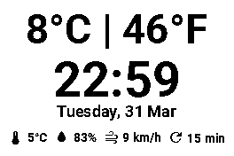

# Weather e-Paper Display

Weather station for a Waveshare 2.7" e-paper display on a Raspberry Pi. Shows temperature (C/F), clock, date, and key metrics at a glance.



## Hardware

- Raspberry Pi (tested on Pi 4 / Pi 5 with Bookworm)
- Waveshare 2.7" B/W e-paper HAT (V2, SSD1680 controller)

## Features

- Temperature in Celsius and Fahrenheit, clock with seconds, date, bottom bar (feels-like, humidity, wind, last update)
- Weather data from [Open-Meteo](https://open-meteo.com/) (no API key required)
- **Multi-screen UI** via the HAT’s four buttons (B/W only; no 4-gray)
- **Screens:** Weather (default), System (hostname, app version, load average), Restart (two-step reboot confirm)
- Automatic retry on API failure (3 attempts, 10s timeout)
- JSON weather history
- Partial refresh for second ticks; periodic full refresh to limit ghosting

## HAT keys (default BCM GPIO)

Verify pinout on [Waveshare’s wiki](https://www.waveshare.com/wiki/2.7inch_e-Paper_HAT) if keys do not respond; override with environment variables.

| Key | GPIO (default) | Action |
|-----|----------------|--------|
| KEY1 | 5 | Previous screen |
| KEY2 | 6 | Next screen |
| KEY3 | 13 | Home (Weather screen) |
| KEY4 | 19 | On **Restart** screen: first press arms reboot, second press runs `systemctl reboot`. Else no-op. |

Leaving the Restart screen with KEY1/KEY2/KEY3 cancels an armed reboot.

## Reboot from the Restart screen

The app runs `sudo -n systemctl reboot`. The `pi` user must be allowed to run that without a password, for example:

```bash
sudo visudo -f /etc/sudoers.d/weatherepaper-reboot
```

Add (replace `pi` if your service user differs):

```
pi ALL=(root) NOPASSWD: /bin/systemctl reboot
```

Save with mode `0440`. If sudo is not configured, the app logs an error and the Pi does not reboot.

## Quick Start

```bash
# Install dependencies
uv sync

# Run with mock display (outputs PNG instead of driving hardware)
WEATHER_EPAPER_MOCK=1 uv run python -m weather_epaper.main --mock --once
```

On the Pi, use `uv sync --extra pi` (see `scripts/run-service.sh`) so **gpiozero** is available for the keys.

## Deploy to Raspberry Pi

```bash
bash scripts/deploy.sh
ssh pi@raspi-epaper.local "bash ~/ePaper_Raspi/scripts/install-service.sh"
```

## Configuration

All settings are via environment variables (set in `deploy/weather-epaper.service`):

| Variable | Default | Description |
|---|---|---|
| `WEATHER_EPAPER_LAT` | `51.4416` | Latitude |
| `WEATHER_EPAPER_LON` | `5.4697` | Longitude |
| `WEATHER_EPAPER_TZ` | system tz | IANA timezone (e.g. `Europe/Amsterdam`) |
| `WEATHER_EPAPER_REFRESH_SEC` | `600` | Weather fetch interval (seconds) |
| `WEATHER_EPAPER_HISTORY_JSON` | `data/weather_history.json` | Path to history file |
| `WEATHER_EPAPER_MOCK` | unset | Set to `1` to write PNG instead of driving e-paper |
| `WEATHER_EPAPER_KEY1_BCM` … `KEY4_BCM` | `5`, `6`, `13`, `19` | HAT button GPIO numbers (BCM) |

## Project Structure

```
src/weather_epaper/
  main.py            # Main loop, weather fetch, keys, display
  render.py          # Weather panel PIL layout
  device.py          # E-paper / mock PNG
  config.py          # Settings from environment
  input_hat.py       # gpiozero HAT buttons → event queue
  ui/
    screens.py       # ScreenId, RenderContext, per-screen rendering
    navigation.py    # ScreenManager, reboot confirm
  weather_client.py  # Open-Meteo client
  weather_history.py # JSON history
  icons.py           # MDI glyphs
fonts/               # Bundled Roboto fonts
third_party/waveshare/
scripts/
deploy/
```

## Future ideas

- Optional **History** screen (scroll recent JSON snapshots) was deferred; the data file is already populated.
